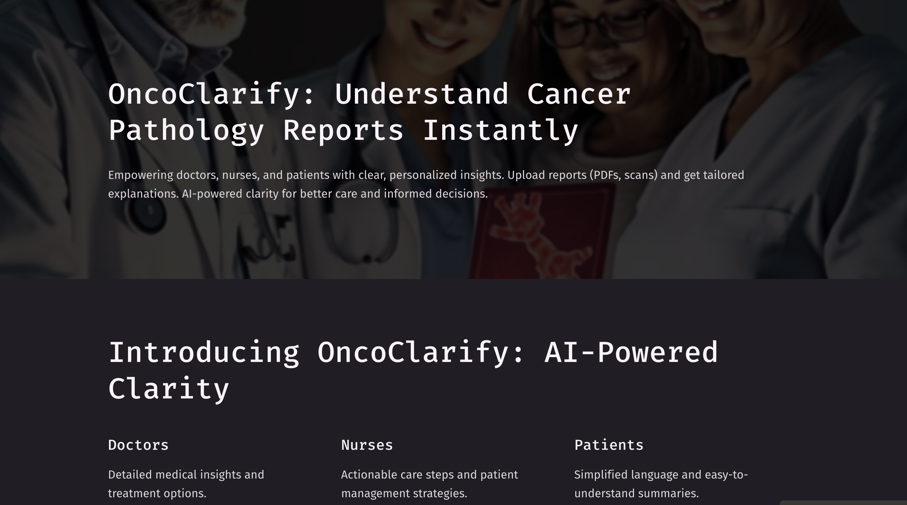
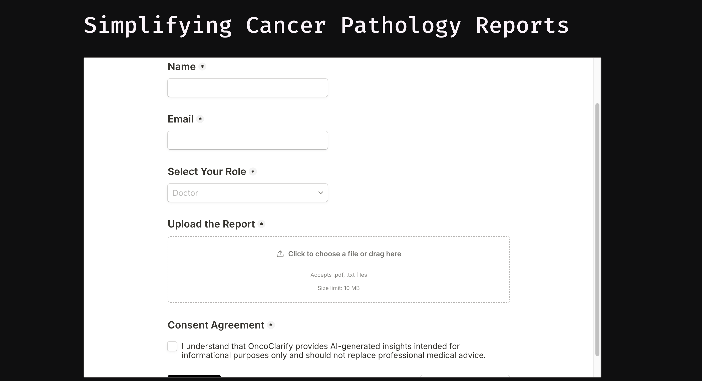

# OncoClarify – AI-Powered Cancer Report Simplifier

## Overview
OncoClarify is a AI tool designed to simplify cancer pathology reports for doctors, nurses, and patients. It leverages Gemini API for text analysis and integrates with Gamma.app, Tally Forms, and Make.com to deliver personalized explanations.

## Problem Statement
Cancer pathology reports are often complex and difficult to understand, especially for patients and non-experts. This tool bridges the gap by generating clear, tailored summaries for different audiences.

## Key Features
- **Report Upload**: Users upload reports via Tally Forms.
- **AI Analysis**: Gemini API extracts key details and generates summaries.
- **Personalized Output**: Summaries are tailored for doctors, nurses, and patients.
- **Email Delivery**: Simplified reports are sent via email using Make.com.

## Tech Stack
- **Frontend**: Gamma.app
- **Data Input**: Tally Forms
- **AI Model**: Gemini API
- **Automation**: Make.com

## Workflow
1. Users upload their reports via Tally Forms.
2. The report is processed using Gemini API.
3. A personalized summary is generated based on the user role.
4. The summary is sent to the user's email via Make.com.

## Screenshots

## How to Replicate
1. Set up a Tally Form for report uploads.
2. Configure Make.com to process data and integrate with Gemini API.
3. Use Gamma.app to design the frontend interface.
4. Test the workflow and deploy.

## Future Enhancements
- Add multi-language support.
- Generate downloadable PDF reports.
- Expand to other medical domains.

## Contact
For questions or feedback, contact kogantisai67@gmail.com
